# Brown et al. - Language Models are Few-Shot Learners

## Abstract

Recent work has demonstrated substantial gains on many NLP tasks and benchmarks by pre-training on a large corpus of text followed by fine-tuning on a specific task. While typically task-agnostic in architecture, this method still requires task-specific fine-tuning datasets of thousands or tens of thousands of examples. By contrast, humans can generally perform a new language task from only a few examples or from simple instructions – something which current NLP systems still largely struggle to do. Here **we show that scaling up language models greatly improves task-agnostic, few-shot performance, sometimes even reaching competitiveness with prior state-of-the-art finetuning approaches**. Specifically, we train GPT-3, an autoregressive language model with 175 billion parameters, 10x more than any previous non-sparse language model, and test its performance in the few-shot setting. **For all tasks, GPT-3 is applied without any gradient updates or fine-tuning, with tasks and few-shot demonstrations specified purely via text interaction with the model. GPT-3 achieves strong performance on many NLP datasets, including translation, question-answering, and cloze tasks, as well as several tasks that require on-the-fly reasoning or domain adaptation, such as unscrambling words, using a novel word in a sentence, or performing 3-digit arithmetic**. At the same time, we also identify some datasets where GPT-3’s few-shot learning still struggles, as well as some datasets where GPT-3 faces methodological issues related to training on large web corpora. Finally, we find that GPT-3 can generate samples of news articles which human evaluators have difficulty distinguishing from articles written by humans. We discuss broader societal impacts of this finding and of GPT-3 in general.

## Contributions

* Exploration whether NLP performance can be improved by simply increasing layer height, model depth, and training size
    - GPT-3 uses the same architecture as GPT-2, just more layers and wider layers.
    - It is trained on a dataset which is effectively a cleaned crawl of the internet
* First model that is designed not to be trained (i.e. parameter updates via gradient steps), but simply presented with a task description, possibly some examples, as strings and then the model is expected to perform the described task
* **The model was released as an API, which makes using this model incredibly easy and cheap for users**

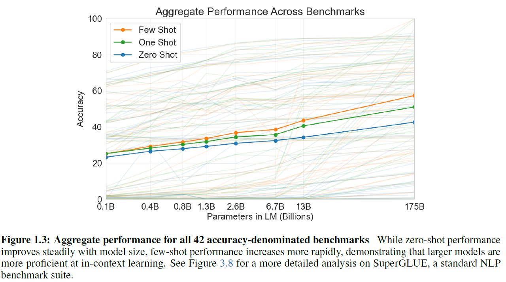

## Discussion and Opinion

* The model is built on the decoder-part of the standard Transformer architecture. There are no changes to architecture or training algorithms, just a larger architecture and more data.
* It is unclear, whether a model as large as GPT-3 does not simply learn the training data, rather than make actual predictions.
* In a particular task, the model will pull out the examples in the training data (which are stored within the weights) that are most similar to the input and interpolate between them to produce the output.
* When examining the performance on certain tasks, it seems that the attention mechanism acts more like a mechanism to filter the training data for relevant examples, and then output is produced by interpolation of these examples rather than that the model has actually learned to understand language.
* Essentially, GPT-3 is a compression mechanism, not a reasoning algorithm
* Amazing fuzzy search and summarization method
* My view is that the results of the paper are more a presentation of the limits of how NLU innovation is measured, rather than evidence that GPT-3 is "intelligent"/
* On the engineering side, however, the decision to publish the model as an API is brilliant
    - The model requires no training, only prompts
    - Given that the model performs "well" on most tasks, new applications can be quickly built
    - So far, most published applications are small, fun, side projects. It remains to be seen if GPT-3 could be used for more critical/relevant applications
    - The API is blocked from UBS... cannot show a demonstration

## Summary of paper

### Background and setting

* NLP has progressed rapidly towards single-architectures that can be 
    - Single-layer representations (Word-to-Vec, Glove) which are fed to task-specific architectures
    - Then came RNNs with multiple layers of representations and contextual states (e.g. ELMo), still applied to task-specific architectures
    - Then came pre-tuned transformer language model which remove the need for task-specific architectures (e.g. BERT, RoBERTa, XLNet) which still require fine-tuning per task
* The paper is an exploration whether a sufficiently large model with sufficiently large data and training computing power removes the need for fine-tuning but just one-shot or few-shot context creation:
    - Fine-Tuning is the process to update the weights of a pre-trained model based on task-specific data
    - Few-Shot demonstration is the process to provide the model with a few examples (10 to 100) that demonstrate the required task. No updates of the trained weights is performed. Only the context of the problem is set.
    - One-Shot is the same as few-shot but with only a single demonstration
    - Zero-Shot requires the model to produce output for a task without any demonstration

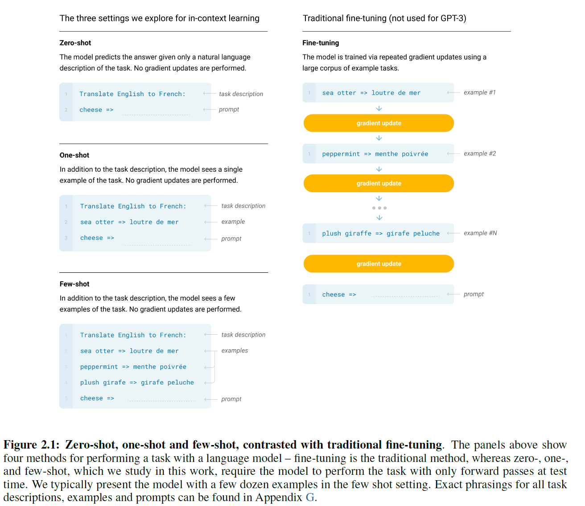

### Model Architecture

We use the same model and architecture as GPT-2, including the modified initialization, pre-normalization, and reversible tokenization described therein, with the exception that we use alternating dense and locally banded sparse attention patterns in the layers of the transformer, similar to the Sparse Transformer. To study the dependence of ML performance on model size, we train 8 different sizes of model, ranging over three orders of magnitude from 125 million parameters to 175 billion parameters, with the last being the model we call GPT-3.

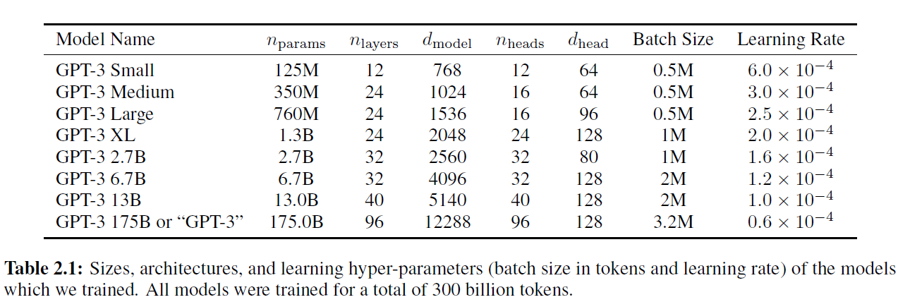

### Training data

Datasets for language models have rapidly expanded, culminating in the Common Crawl dataset constituting
nearly a trillion words. This size of dataset is sufficient to train our largest models without ever updating on the same sequence twice. However, we have found that unfiltered or lightly filtered versions of Common Crawl tend to have lower quality than more curated datasets. Therefore, we took 3 steps to improve the average quality of our datasets:

1. We downloaded and filtered a version of CommonCrawl based on similarity to a range of high-quality reference corpora
2. We performed fuzzy deduplication at the document level, within and across datasets, to prevent redundancy and preserve the integrity of our held-out validation set as an accurate measure of overfitting
3. We also added known high-quality reference corpora to the training mix to augment CommonCrawl and increase its diversity.

The CommonCrawl data was downloaded from 41 shards of monthly CommonCrawl covering 2016 to 2019, constituting 45TB of compressed plaintext before filtering and 570GB after filtering, roughly equivalent to 400 billion byte-pair-encoded tokens.

A major methodological concern with language models pretrained on a broad swath of internet data, particularly large models with the capacity to memorize vast amounts of content, is potential contamination of downstream tasks by having their test or development sets inadvertently seen during pre-training. To reduce such contamination, we searched for and attempted to remove any overlaps with the development and test sets of all benchmarks studied in this paper.

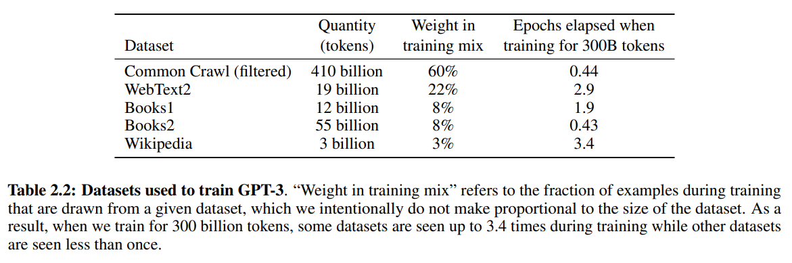

### Training Process

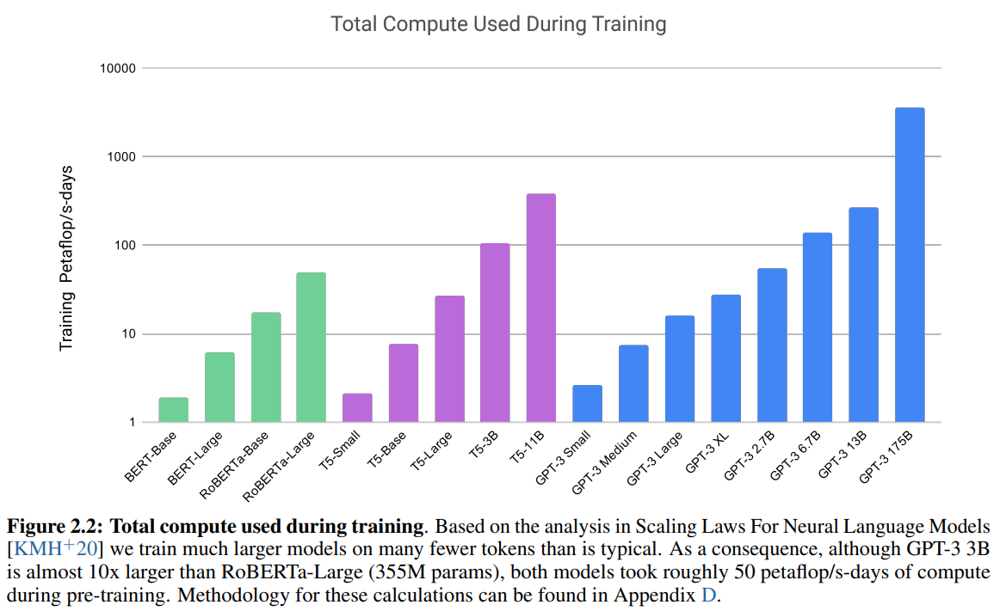

### Performance by compute for training and model size

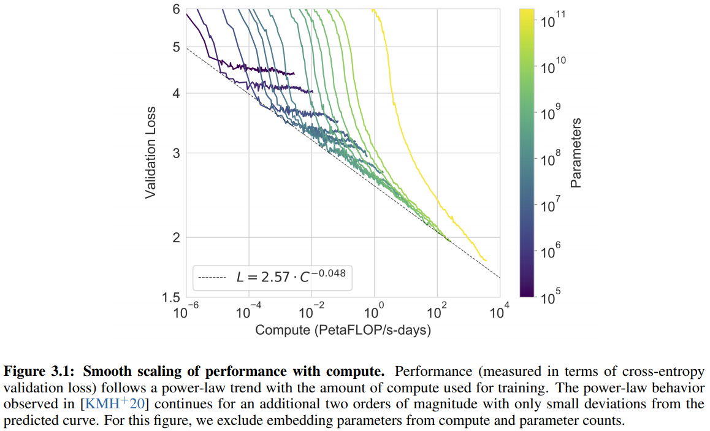

The chart presents the validation loss (perplexity) by PetaFLOP/s-days. Both are log scale.
As you scale up model size and/or compute time, model performance / validation loss follow a power law. The results give no indication that we have reached the end of the trend.

### Results for different tasks

* Language Modeling, Cloze, and Completion Tasks
* Closed Book Question Answering
* Translation
* Winograd-Style Tasks
* Common Sense Reasoning
* Reading Comprehension
* SuperGLUE
* NLI
* Synthetic and Qualitative Tasks

#### Language Modeling, Cloze, and Completion Tasks

Aim: Test GPT-3’s performance on the traditional task of language modeling, as well as related tasks that involve predicting a single word of interest, completing a sentence or paragraph, or choosing between possible completions of a piece of text.

* The LAMBADA dataset tests the modeling of long-range dependencies in text – the model is asked to predict the last word of sentences which require reading a paragraph of context.
* The HellaSwag dataset involves picking the best ending to a story or set of instructions. The examples were adversarially mined to be difficult for language models while remaining easy for humans (who achieve 95.6% accuracy).
* The StoryCloze 2016 dataset involves selecting the correct ending sentence for five-sentence long stories.

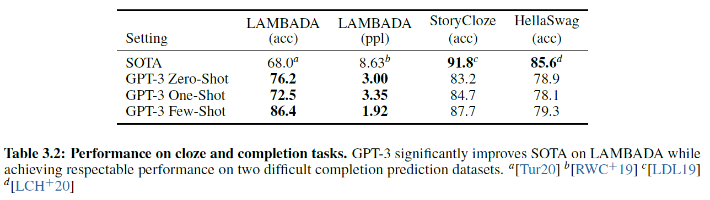

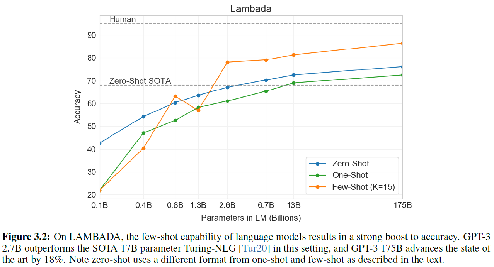

#### Closed Book Question Answering

Aim: Measure GPT-3’s ability to answer questions about broad factual knowledge.

Task: Given a direct question, provide answer or chose from possible answers the correct one.

Task description: "Answer the Question"
Examples:
* Who climed Mount Everest first? => Hilary
* What day of the week is today? => Thursday
* ...

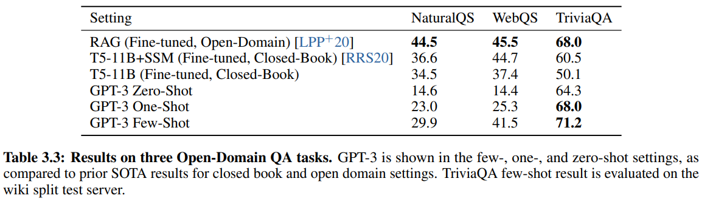

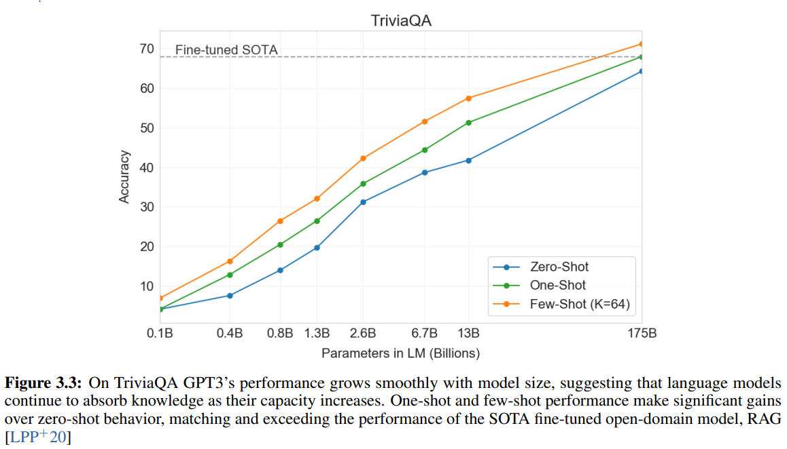

#### Translation

Task: Translate a sequence from one language to another language

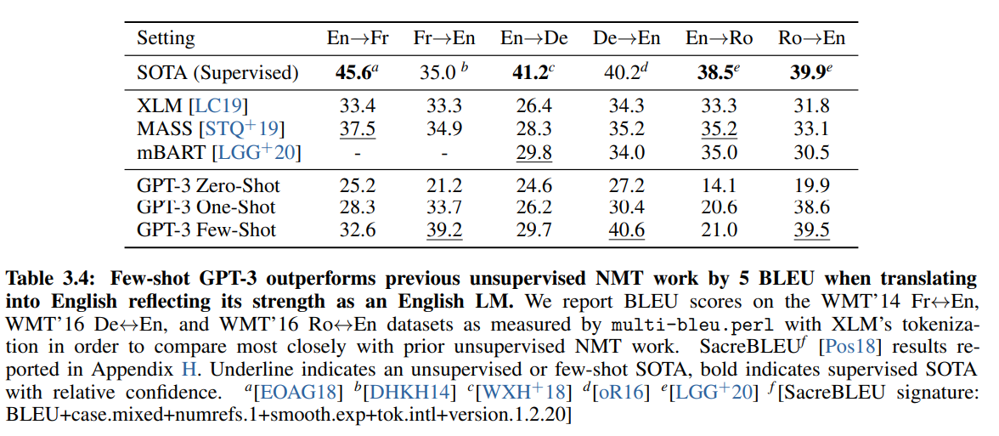

* As model goes up in parameters, performance improves.
* The model performs better if target language is English.
* Does not make much difference from what language you want to translate to English

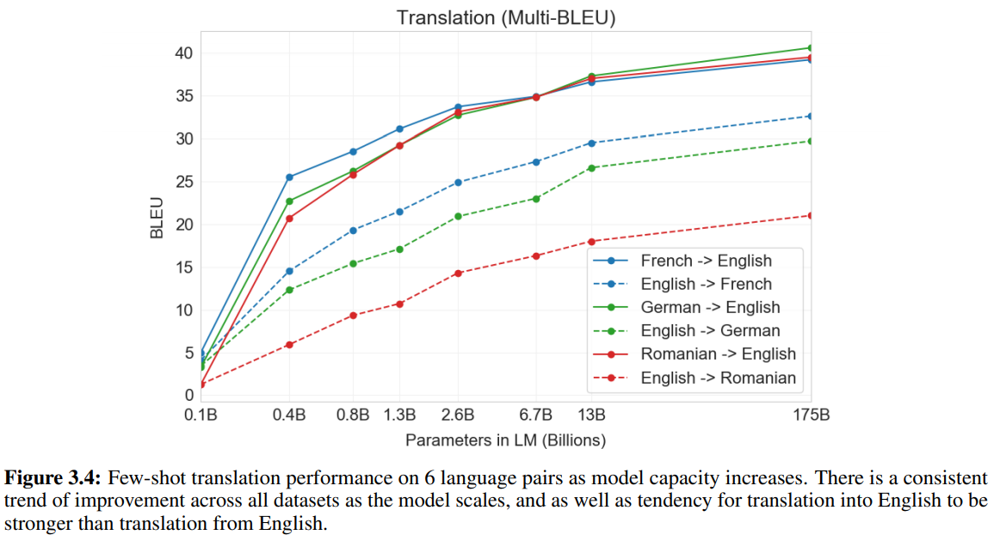

To english, GPT-3 beats supervised as well as unsupervised, but task-specific, models

#### Winograd-Style Tasks

The Winograd Schemas Challenge is a classical task in NLP that involves determining which word a pronoun refers to, when the pronoun is grammatically ambiguous but semantically unambiguous to a human.

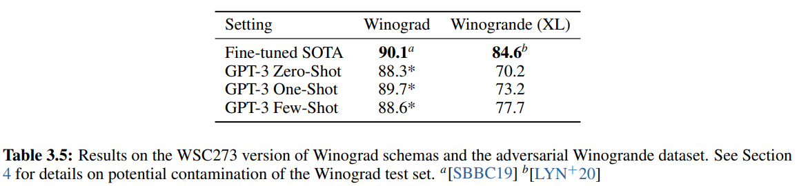

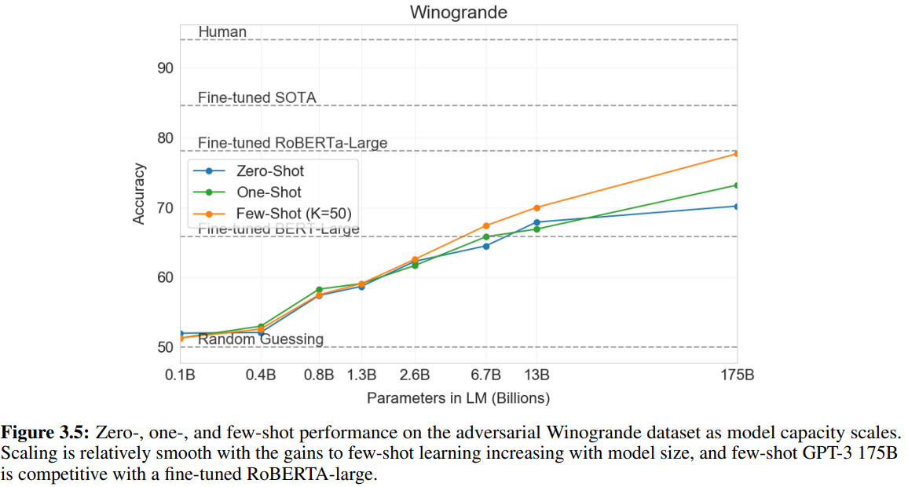

#### Common Sense Reasoning

* **PhysicalQA** (PIQA) asks common sense questions about how the physical world works and is intended as a probe of grounded understanding of the world.
* **ARC** is a dataset of multiple-choice questions collected from 3rd to 9th grade science exams. On the "Challenge" version of the dataset which has been filtered to questions which simple statistical or information retrieval methods are unable to correctly answer.
* **OpenBookQA** is a question-answering dataset modeled after open book exams for assessing human understanding of a subject

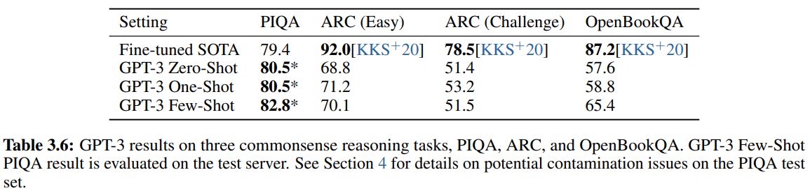

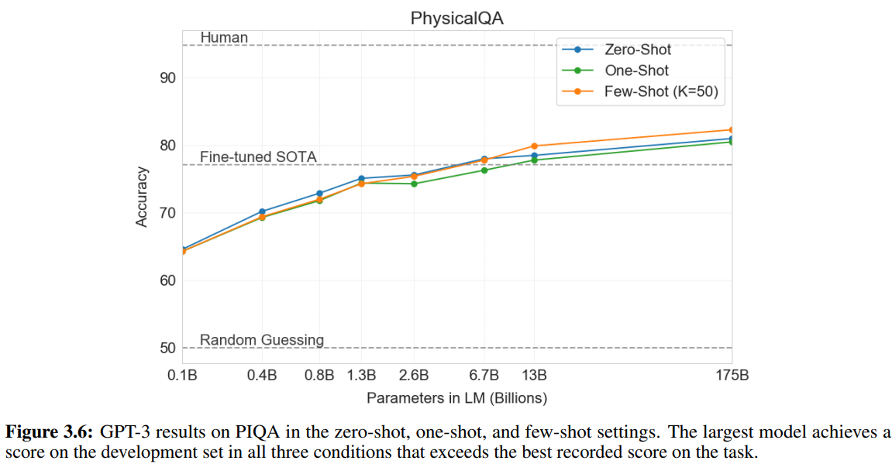

But, potential contamination issue, in the sense that there is potentially a significant overlap of evaluation and training data set. This was due to a bug in their cleaning code.

The paper makes the argument that this is not an issue, but comparing the results for other data, it seems that it is.
Also, the fact that the differences between zero-shot, one-shot, and few-shot training makes essentially no difference suggests that the model already knows the answer.

#### Reading Comprehension and SuperGLUE

Next we evaluate GPT-3 on the task of reading comprehension. We use a suite of 5 datasets including abstractive, multiple choice, and span based answer formats in both dialog and single question settings.

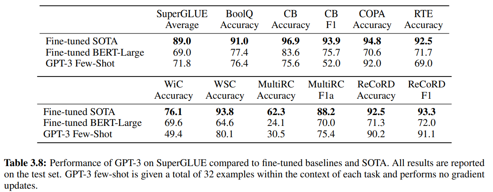

On the tasks that GPT-3 performs particularly badly, you cannot do pattern matching or interpolation. You have to do actual reasoning.

#### NLI

Natural Language Inference (NLI) concerns the ability to understand the relationship between two sentences. In practice, this task is usually structured as a two or three class classification problem where the model classifies whether the second sentence logically follows from the first, contradicts the first sentence, or is possibly true (neutral).

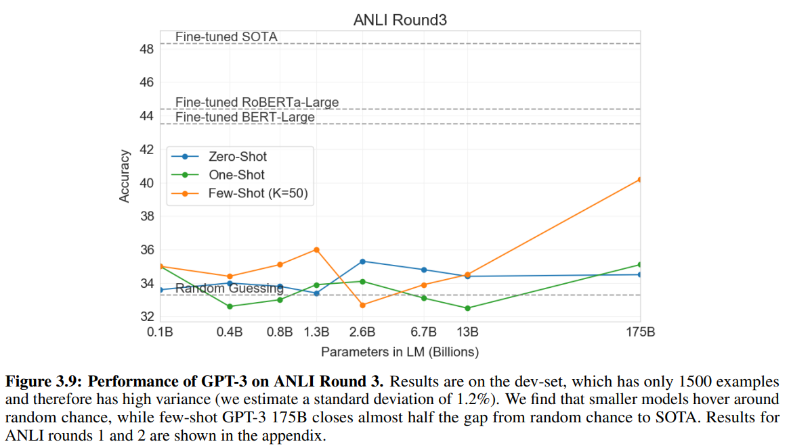

#### Synthetic and Qualitative Tasks

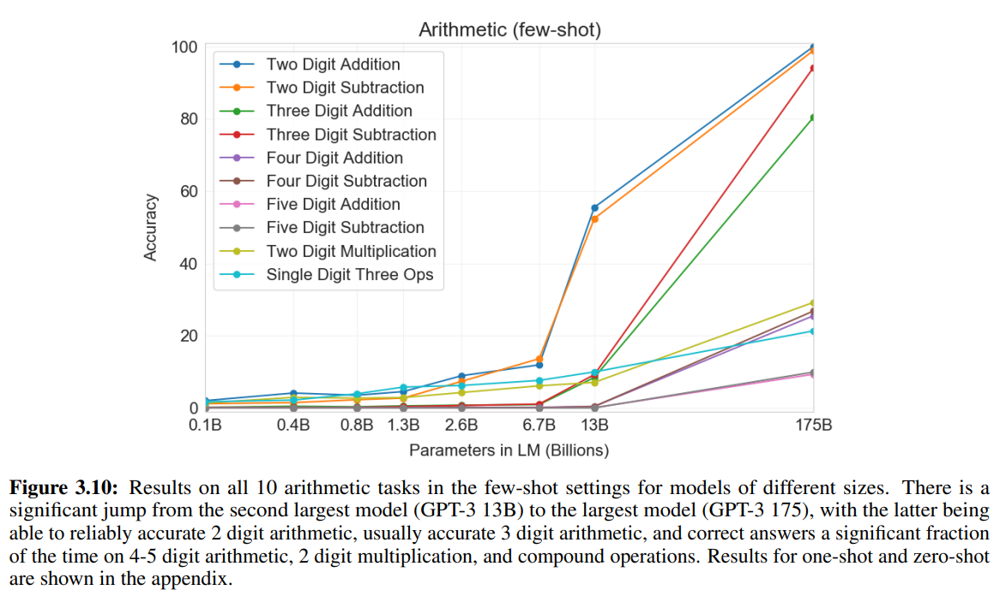

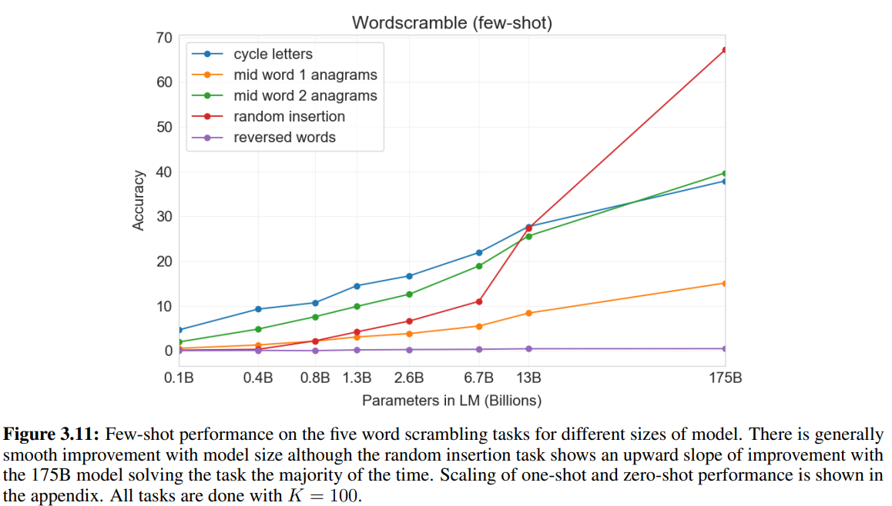

The paper argues that the model must have learned "something" as it has only learned from strings and it is able to "learn" the ability to do (simple) arithmetics.

## Examination of test data corruption

We produce a ‘clean’ version which removes all potentially leaked examples, defined roughly as examples that have a 13-gram overlap with anything in the pretraining set (or that overlap with the whole example when it is shorter than 13-grams). The goal is to very conservatively flag anything that could potentially be contamination, so as to produce a clean subset that is free of contamination with high confidence.

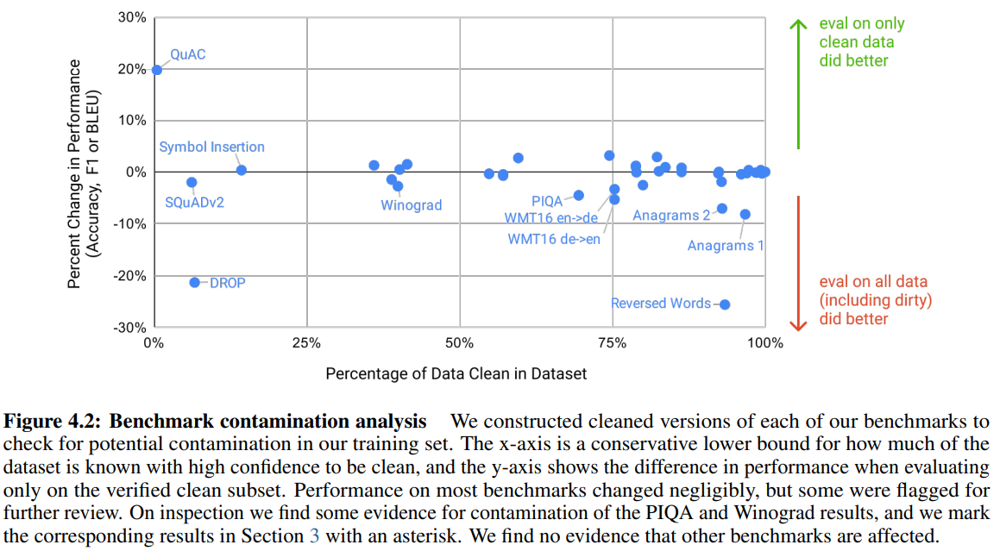

Only n-gram deduplication is performed.
To argue that the model is able to reason, the data cleaning seems limited

#### Implications for explainability

* Most approaches for explainability focus on attribution
* For NLP, it will become important to understand which training samples were most responsible for the prediction by keeping a record of the influence of samples on the attention heads

